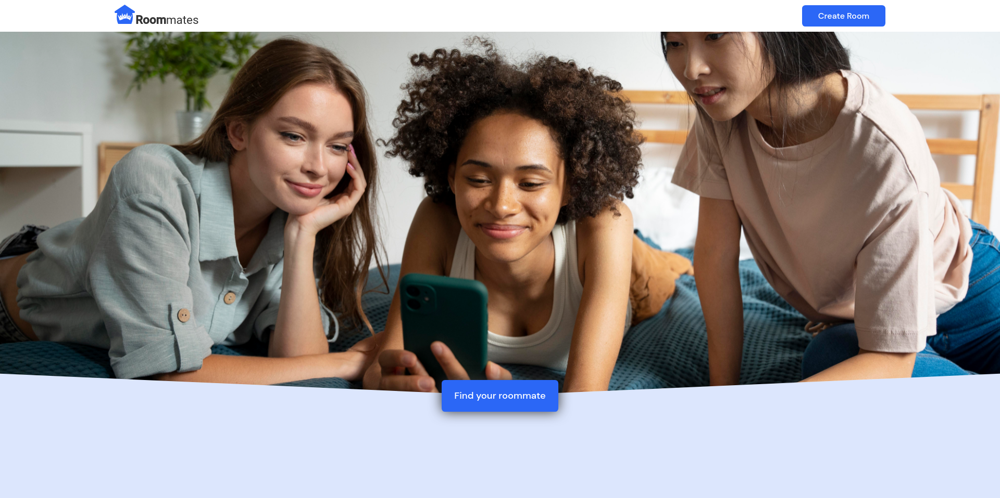
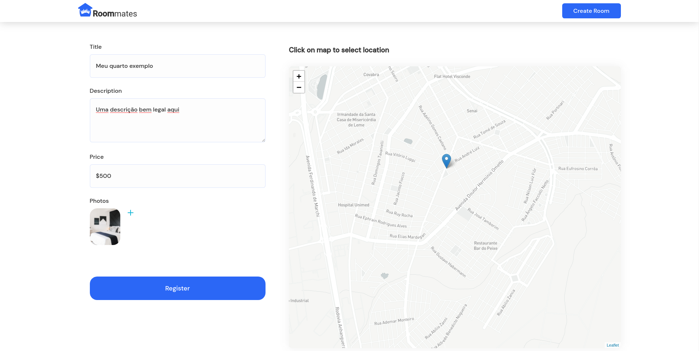
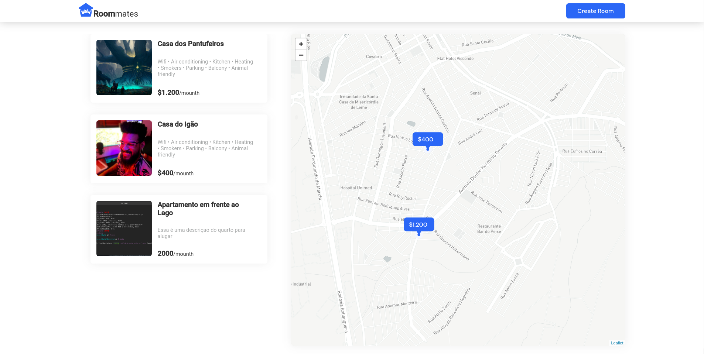
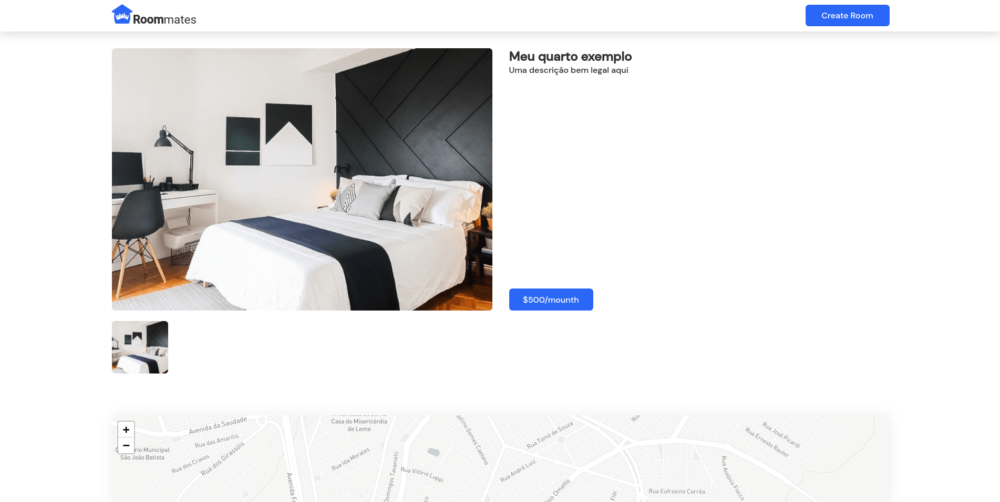

<p align="center">
  

  
  
  <a href="https://github.com/tgmarinho/README-ecoleta/commits/master">
    
  </a>
    
  
</p>
<h1 align="center">
    
</h1>

<h4 align="center"> 
	Roommates 🚧
</h4>

<p align="center">
 <a href="#-sobre-o-projeto">Sobre</a> •
 <a href="#-funcionalidades">Funcionalidades</a> •
 <a href="#-layout">Layout</a> • 
 <a href="#-como-executar-o-projeto">Como executar</a> • 
 <a href="#-tecnologias">Tecnologias</a> • 
 <a href="#-contribuidores">Contribuidores</a> • 
 <a href="#-autor">Autor</a> • 
 <a href="#user-content--licença">Licença</a>
</p>

## 💻 Sobre o projeto

🏠 Roommates - é uma plataforma que conecta pessoas á quartos de aluguel.

Projeto desenvolvido para fins de estudo.

---

## ⚙️ Funcionalidades

- [x] Cadastrado de quartos, com Titulo, Descrição, Preço, Fotos e Localização
- [x] Navegar pelo mapa para ver os quartos cadastrados

---

## 🎨 Layout

<p align="center" style="display: flex; align-items: flex-start; justify-content: center;">
  
  
</p>
<p align="center" style="display: flex; align-items: flex-start; justify-content: center;">
  
  
</p>

---

## 🚀 Como executar o projeto

Este projeto é divido em duas partes:

1. [Backend](https://github.com/falaigor/roommates-api/)
2. Frontend

💡Frontend precisa que o Backend esteja sendo executado para funcionar.

### Pré-requisitos

Antes de começar, você vai precisar ter instalado em sua máquina as seguintes ferramentas:
[Git](https://git-scm.com), [Node.js](https://nodejs.org/en/) versão 14.x.
Além disto é bom ter um editor para trabalhar com o código como [VSCode](https://code.visualstudio.com/)

#### 🎲 Rodando o Backend (servidor)

Seguir as [Instruções](https://github.com/falaigor/roommates-api/README.md) para rodar a aplicação Backend

#### 🧭 Rodando a aplicação web (Frontend)

```bash

# Clone este repositório
$ git clone git@github.com:falaigor/roommates-web.git

# Acesse a pasta do projeto no seu terminal/cmd
$ cd roommates-web

# Instale as dependências
$ npm install ou yarn

# Execute a aplicação em modo de desenvolvimento
$ npm run start ou yarn start

# A aplicação será aberta na porta:3000 - acesse http://localhost:3000

```

### .env

Renomeie o `.env.example` no diretório raiz para `.env` e atualize com suas configurações.

[Mapbox](https://www.mapbox.com) foi usado como rederizador visual do mapa.

| key                    | description        | default                   |
| ---------------------- | ------------------ | ------------------------- |
| REACT_APP_MAPBOX_TOKEN | Token do MAPBOX    | `Adiconar o token gerado` |
| REACT_APP_BASEURL_API  | URL da API Backend | `http://localhost:4000`   |

---

## 🛠 Tecnologias

As seguintes ferramentas foram usadas na construção do projeto:

#### **Website** ([React](https://reactjs.org/) + [TypeScript](https://www.typescriptlang.org/))

- **[React Router Dom](https://github.com/ReactTraining/react-router/tree/master/packages/react-router-dom)**
- **[React Icons](https://react-icons.github.io/react-icons/)**
- **[Axios](https://github.com/axios/axios)**
- **[Leaflet](https://react-leaflet.js.org/en/)**
- **[React Leaflet](https://react-leaflet.js.org/)**
- **[Styled Components](https://styled-components.com)**

> Veja o arquivo [package.json](https://github.com/falaigor/roommates-web/blob/develop/package.json)

#### [](https://github.com/tgmarinho/Ecoleta#server-nodejs--typescript)**Server** ([NodeJS](https://nodejs.org/en/) + [TypeScript](https://www.typescriptlang.org/))

- **[Express](https://expressjs.com/)**
- **[CORS](https://expressjs.com/en/resources/middleware/cors.html)**
- **[Prisma](https://www.prisma.io)**
- **[SQLite](https://github.com/mapbox/node-sqlite3)**
- **[ts-node](https://github.com/TypeStrong/ts-node)**
- **[dotENV](https://github.com/motdotla/dotenv)**
- **[Multer](https://github.com/expressjs/multer)**

> Veja o arquivo [package.json](https://github.com/falaigor/roommates-api/blob/main/package.json)

#### [](https://github.com/tgmarinho/Ecoleta#utilit%C3%A1rios)**Utilitários**

- Protótipo: **[Figma](https://www.figma.com/)**
- Maps: **[Leaflet](https://react-leaflet.js.org/en/)**
- Editor: **[Visual Studio Code](https://code.visualstudio.com/)** → Extensions: **[SQLite](https://marketplace.visualstudio.com/items?itemName=alexcvzz.vscode-sqlite)**
- Markdown: **[StackEdit](https://stackedit.io/)**, **[Markdown Emoji](https://gist.github.com/rxaviers/7360908)**
- Commit Conventional: **[Commitlint](https://github.com/conventional-changelog/commitlint)**
- Teste de API: **[Insomnia](https://insomnia.rest/)**
- Ícones: **[Feather Icons](https://feathericons.com/)**
- Fontes: **[DM Sans](https://fonts.google.com/specimen/DM+Sans)**, **[Roboto](https://fonts.google.com/specimen/Roboto)**

## 💪 Como contribuir para o projeto

1. Faça um **fork** do projeto.
2. Crie uma nova branch com as suas alterações: `git checkout -b my-feature`
3. Salve as alterações e crie uma mensagem de commit contando o que você fez: `git commit -m "feature: My new feature"`
4. Envie as suas alterações: `git push origin my-feature`

---

## 🦸 Autor

<a href="https://blog.rocketseat.com.br/author/thiago/">
 
 <br />
 <sub><b>Igor Santos</b></sub></a> <a href="https://instagram.com/falaigors/" title="Instagram Igor Santos">🚀</a>
 <br />

[](https://twitter.com/falaigors)
[](https://www.linkedin.com/in/falaigor/)
[](mailto:falaigors@gmail.com)

---

## 📝 Licença

Este projeto esta sobe a licença [MIT](./LICENSE).

Feito com ❤️ por Igor Santos 👋🏽 [Entre em contato!](https://www.linkedin.com/in/falaigor/)
